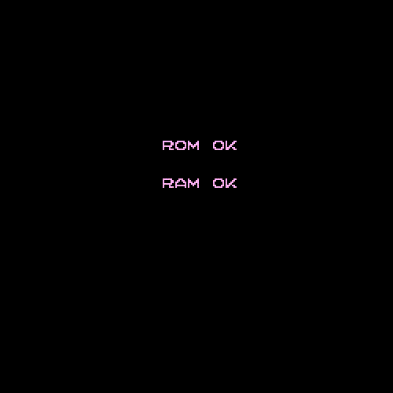

# Ladybug

This is a modern remake of the classic arcade game from 1981 "Ladybug" by Universal.

I'm fond of the game and I've had this desire to try to write a video game for a long time, so I decided to "kill two birds with one stone" by remaking Ladybug.

I have never written a game before, so who knows? I might just be wasting time. We'll see.

## Game framework

I had a quick look at the vast array of game frameworks there are out there in 2020. Initially I wanted (I still do) to disassemble the original ladybug arcade roms, learn how the mame emulation of it works, etc... Maybe I'll get to that one day. For now, I thought I should select a lightweight environment to work with. That implies no Unity or things like that. I've had another long-term desire to play with Lua, a language I found interesting because of its philosophy and simplicity.

I found the perfect synthesis of these ideas in [LÖVE](https://love2d.org/), so that is what I'm using for this video game remake.

## How to run the "game"?

There's no game yet, but you run it by installing LÖVE first and then running:

    love .

in the game source directory.

## Current status

---

May you have fun.

The end
